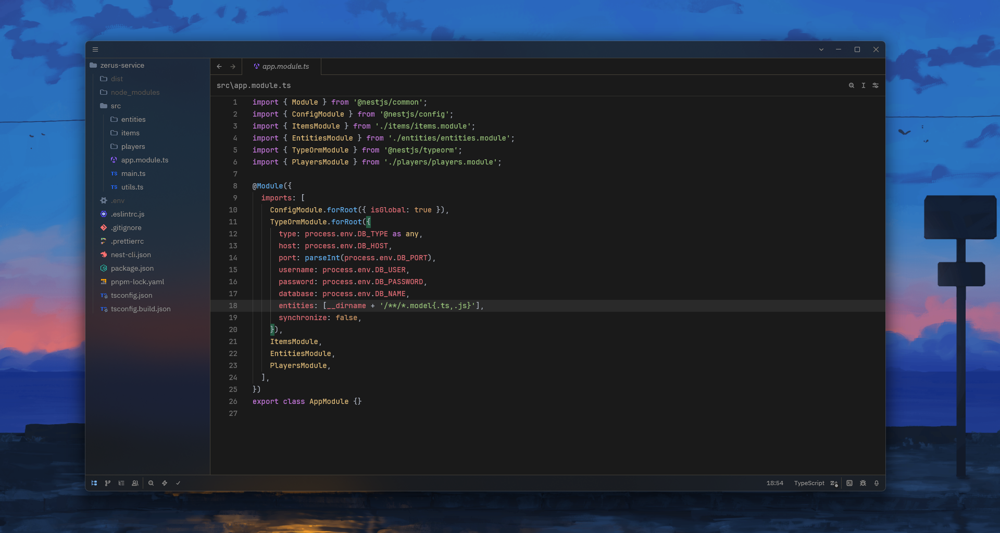

# Min Theme Plus

The ported VSCode theme is based on Min Theme and One Dark Pro for Zed.

## Screenshots

## Credits

The color scheme for the UI is taken from [Miguel Solorio's Min Theme for VSCode](https://github.com/miguelsolorio/min-theme).
The color scheme for the code is taken from [Zed One Dark Pro](https://github.com/mordfustang21/zed-one-dark-pro).

## License

This project is licensed under the MIT License - see the [LICENSE](LICENSE) file
for details.
